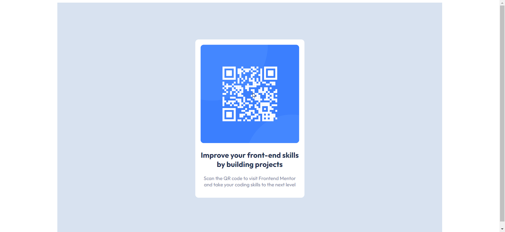

# Frontend Mentor - QR code component solution

This is a solution to the [QR code component challenge on Frontend Mentor](https://www.frontendmentor.io/challenges/qr-code-component-iux_sIO_H). Frontend Mentor challenges help you improve your coding skills by building realistic projects. 

## Table of contents

- [Overview](#overview)
  - [Screenshot](#screenshot)
  - [Links](#links)
- [My process](#my-process)
  - [Built with](#built-with)
  - [What I learned](#what-i-learned)
  - [Continued development](#continued-development)
  - [Useful resources](#useful-resources)
- [Author](#author)
- [Acknowledgments](#acknowledgments)

## Overview

### Screenshot

screenshots 1: url(#)
screenshots 2: url(#)


### Links

- Solution URL: https://github.com/spr-nova/QR-code--test

## My process

### Built with

- Semantic HTML5 markup
- CSS custom properties
- Media Queries


### What I learned

I used media queries to make QR code responsivei didn't learn somthing new in this applcation but i will keep example below to note forget how to write them  

To see how you can add code snippets, see below:

```html
<h1>Some HTML code I'm proud of</h1>
```
```css
.proud-of-this-css {
  color: papayawhip;
}
```
```js
const proudOfThisFunc = () => {
  console.log('🎉')
}
```


### Continued development

i didint find somthing hard in this example exept for some things like how i should now heigth and width of the card 

### Useful resources
I didnt use any resources
- [Example resource 1](https://www.example.com) - This helped me for XYZ reason. I really liked this pattern and will use it going forward.
- [Example resource 2](https://www.example.com) - This is an amazing article which helped me finally understand XYZ. I'd recommend it to anyone still learning this concept.


## Author

- Website - [Manaf Hajriffi](https://github.com/spr-nova)
- Frontend Mentor - [@spr-nova](https://www.frontendmentor.io/profile/spr-nova)


## Acknowledgments

no one helped me in this project 

